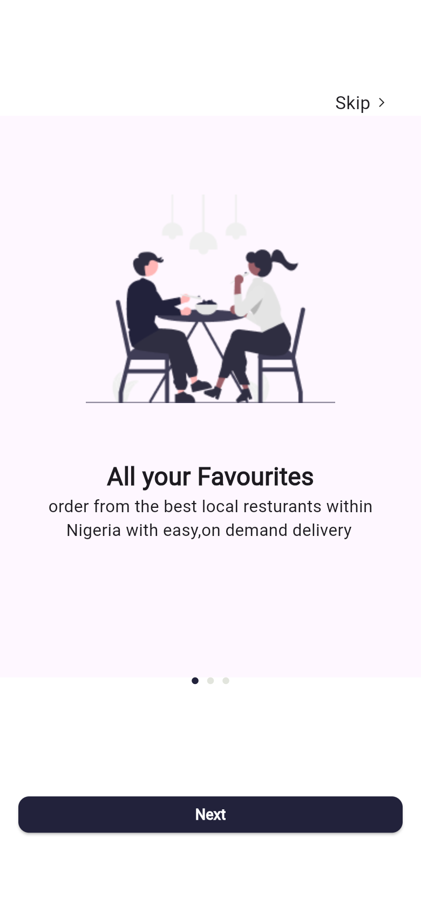
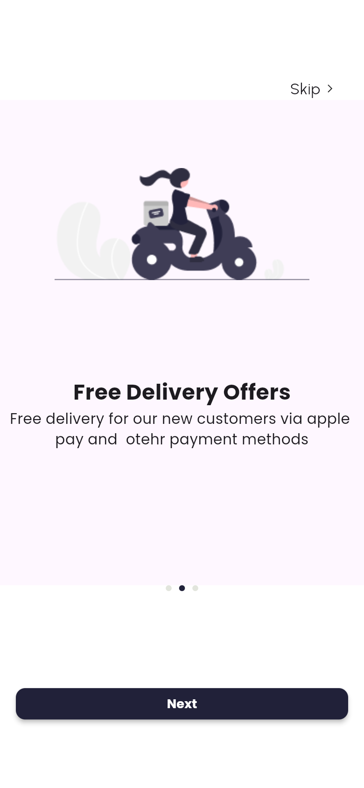
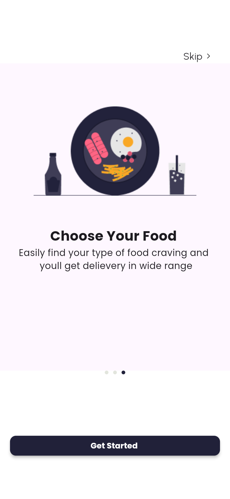
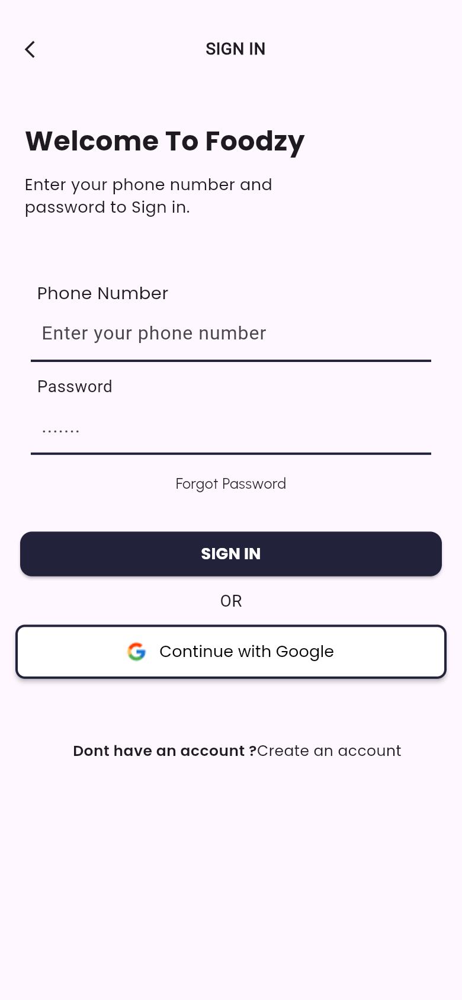
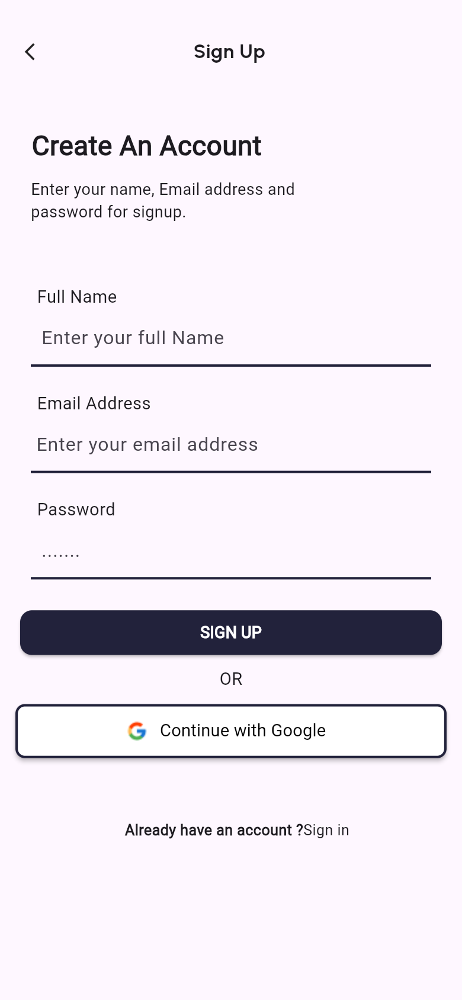
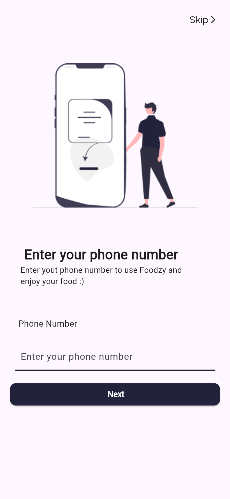
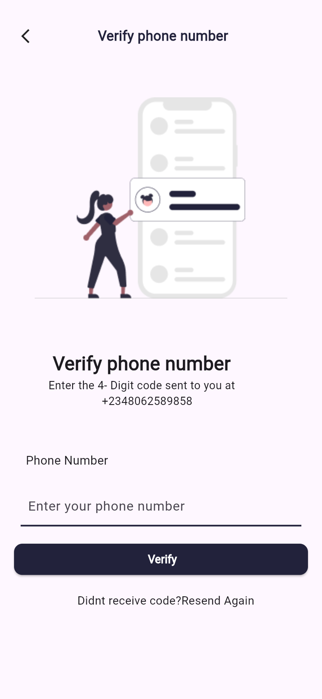
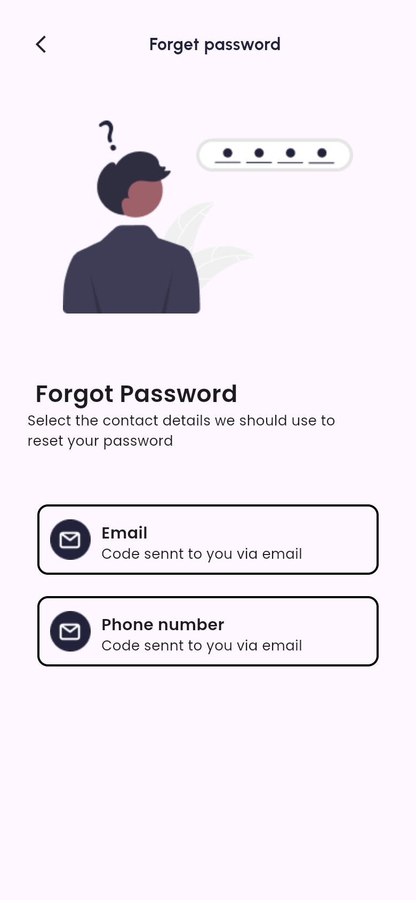
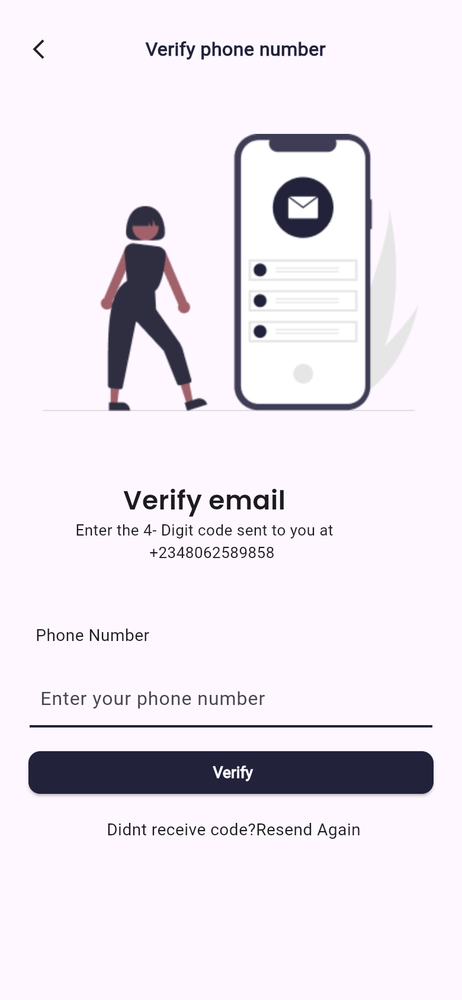
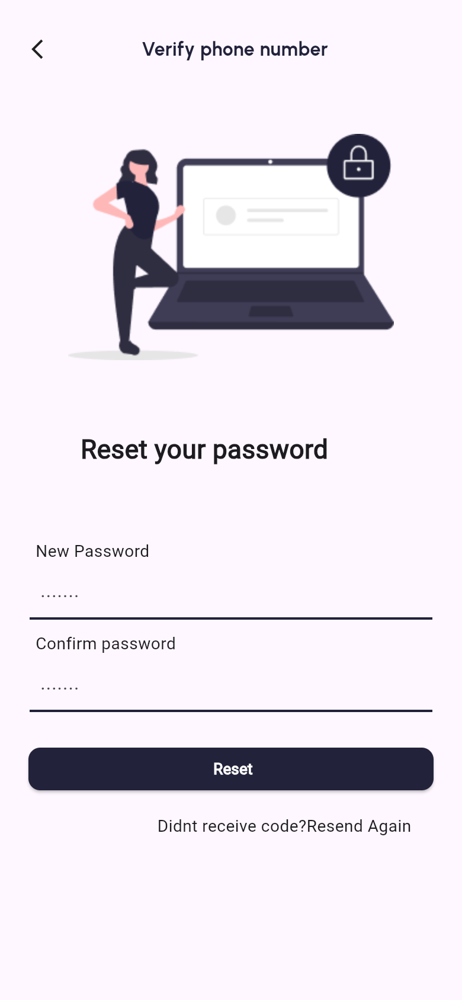

# Foodzy

**A food delivery app UI for Nigerian restaurants, built with Flutter.** It covers onboarding, sign-in, sign-up, phone verification and the full password-recovery flow.


> **Status: UI prototype / work in progress.** The onboarding and authentication screens are fully built and navigable. Backend integration (auth, restaurants, ordering, payments) is not implemented yet, so the buttons move between screens but do not call a server.

## Screenshots

<table>
  <tr>
    <td align="center"><br><sub>Onboarding 1</sub></td>
    <td align="center"><br><sub>Onboarding 2</sub></td>
    <td align="center"><br><sub>Onboarding 3</sub></td>
    <td align="center"><br><sub>Sign in</sub></td>
  </tr>
  <tr>
    <td align="center"><br><sub>Sign up</sub></td>
    <td align="center"><br><sub>Add phone number</sub></td>
    <td align="center"><br><sub>Verify phone (OTP)</sub></td>
    <td align="center"><br><sub>Forgot password</sub></td>
  </tr>
  <tr>
    <td align="center"><br><sub>Verify email</sub></td>
    <td align="center"><br><sub>Reset password</sub></td>
    <td></td><td></td>
  </tr>
</table>

## Features

- **Onboarding carousel:** 3 illustrated pages built with `PageView`, with an animated page indicator, Skip, Next and Get Started.
- **Sign in / Sign up:** phone number and password sign-in, sign-up with name, email and password, and a "Continue with Google" button (UI only).
- **Phone verification:** add a phone number, then a 4-digit code verification screen with "Resend".
- **Password recovery:** choose email or phone as the recovery channel, verify, then set and confirm a new password.
- **Responsive sizing:** `flutter_screenutil` scales the design (375×812) to any screen size.
- **Native splash screen** via `flutter_native_splash`.
- Named-route navigation between all screens.

## Tech stack

| Area | Tools |
|---|---|
| Framework | Flutter, Dart 3 |
| UI | Material, `google_fonts` (Poppins / Urbanist), `smooth_page_indicator` |
| Layout | `flutter_screenutil` |
| Splash | `flutter_native_splash` |

## Project structure

```
lib/
├── main.dart            # App entry, ScreenUtil setup, named routes
├── splashscreen.dart    # Onboarding carousel (PageView + indicator)
├── onboarding/          # page1, page2, page3 onboarding slides
├── signinscreen.dart    # Sign in
├── signupscreen.dart    # Sign up
├── addphone.dart        # Add phone number + OTP verification
└── forget.dart          # Forgot password → verify → reset flow
images/                  # Illustrations and icons
```

## Getting started

```bash
git clone https://github.com/Mickool17/Foodzy.git
cd Foodzy
flutter pub get
flutter run            # Android / iOS device or emulator
flutter run -d chrome  # or run it in the browser
```

Requires Flutter 3.x (Dart 3).

## Roadmap

- [ ] Restaurant listing and menu screens
- [ ] Cart, checkout and payments
- [ ] Real authentication (Firebase / REST API)
- [ ] Live order and delivery tracking with maps

## Author

Built by [@Mickool17](https://github.com/Mickool17)
